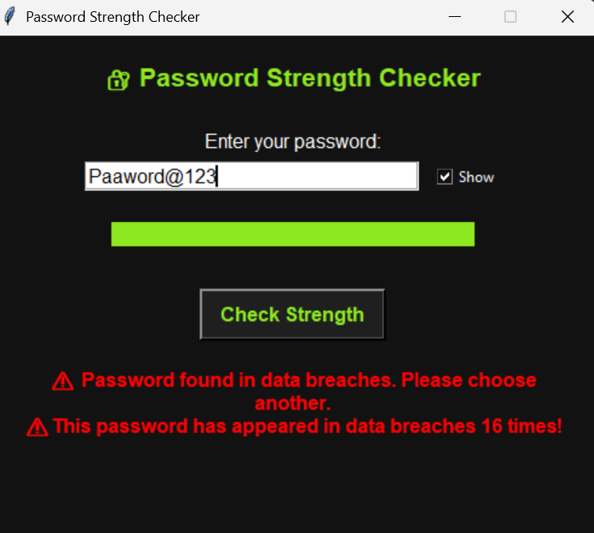

# Password Strength Checker with Breach Detection

A secure and educational Python application that evaluates password strength and checks if your password has been exposed in data breaches using the Have I Been Pwned API. Developed as part of my internship at Tamizhan Skills, this project blends usability, cybersecurity, and real-time feedback to help users make better decisions when choosing passwords.

---

## Table of Contents

1. [General Info](#general-info)
2. [Project Status](#project-status)
3. [Screenshot](#screenshot)
4. [Architecture Diagram](#architecture-diagram)
5. [Technologies](#technologies)
6. [Requirements](#requirements)
7. [Installation & Usage](#installation--usage)
8. [Troubleshooting](#troubleshooting)
9. [Collaboration](#collaboration)
10. [Known Issues & Bug Fixes](#known-issues--bug-fixes)
11. [FAQs](#faqs)
12. [Recommendations for Improvement](#recommendations-for-improvement)
13. [Acknowledgements](#acknowledgements)

---

## General Info

This project is a GUI-based Password Strength Checker that not only analyzes complexity but also connects to the Have I Been Pwned (HIBP) API to detect whether a password has been compromised in real-world breaches. It combines real-time feedback, animated strength indicators, and user-friendly design for maximum impact and awareness.

---

## Project Status

* *Status:* Completed (July 2025)

---

## Screenshot




---

## Architecture Diagram

```text
+--------------+         +----------------+          +----------------------------+
| User Input   | ----->  | Strength Logic |   -----> | Have I Been Pwned API Call |
+--------------+         +----------------+          +----------------------------+
         |                        |                                  |
         v                        v                                  v
   GUI Result Box        Password Score %                Breach Status + Count
```

---
## What Makes This Project Stand Out
Unlike traditional password checkers that only evaluate character complexity, this project takes password security a step further by integrating real-world breach data. Here’s how it stands out:

Real-Time Breach Detection Using HIBP API
The application connects to the Have I Been Pwned (HIBP) API to check if the entered password has ever been exposed in known data breaches — and shows how many times. This brings awareness to users that even complex-looking passwords can still be unsafe.

Interactive and User-Friendly GUI
Built using Tkinter, the application offers a modern, minimal, and accessible interface with real-time feedback, clear suggestions, and an animated strength bar that visually represents the password’s strength.

Educational and Ethical Design
Designed as part of a cybersecurity internship, the project emphasizes not just functionality but user education — explaining why passwords fail and how to improve them. It balances technical accuracy with usability, making it suitable for awareness campaigns, workshops, or student learning tools.

---

## Technologies

* [Python 3](https://www.python.org/)
* [Tkinter](https://docs.python.org/3/library/tkinter.html) for GUI
* [re](https://docs.python.org/3/library/re.html) for regex pattern matching
* [hashlib](https://docs.python.org/3/library/hashlib.html) for SHA-1 hashing
* [requests](https://docs.python-requests.org/) for API communication

---

## Requirements

* Python 3.8+
* Internet connection (for API calls)
* Required packages:

```bash
pip install requests
```

---

## Installation & Usage

1. Clone this repository:

```bash
git clone https://github.com/abireshu/password-strength-checker.git
cd password-strength-checker
```

2. Run the application:

```bash
python pwd_Strength_checker.py
```

> Make sure `pwd_Scheck_code.py` and `breach_check.py` are in the same folder.

---

## Troubleshooting

| Issue                   | Solution                                                 |
| ----------------------- | -------------------------------------------------------- |
| HIBP API not working    | Check your internet connection or wait and retry         |
| GUI not opening         | Ensure you are running Python 3 and Tkinter is installed |
| Password not recognized | Input field may be empty or non-string                   |

---

## Collaboration

Contributions are welcome! Please follow standard GitHub contribution practices:

* Fork the repo and clone
* Create a new branch (`git checkout -b feature-branch`)
* Commit your changes
* Push and open a Pull Request

---

## Known Issues & Bug Fixes

* Currently, only single password input is supported (no batch mode)
* Strength suggestions are static based on regex and do not use machine learning
* UI doesn’t store previous entries or allow export

---

## FAQs

**Q: Does it store my password?**
A: No. Passwords are not saved or logged at any point.

**Q: Is it secure to use the HIBP API?**
A: Yes. Only the first 5 characters of the password’s hash are sent, preserving full privacy.

**Q: Can I use this offline?**
A: The strength checker works offline, but breach detection requires an internet connection.

---

## Recommendations for Improvement

| Feature                                  | Priority |
| ---------------------------------------- | -------- |
| Offline breach detection (local dataset) | High     |
| Dark/light theme toggle                  | Medium   |
| Export results to PDF or CSV             | Low      |
| Add password generator tool              | Medium   |

---

## Acknowledgements

* [Have I Been Pwned API](https://haveibeenpwned.com/API/v3) – For breach data.
* Tamizhan Skills – For mentorship and internship opportunity.
* Python Community – For open-source documentation and support.

---

